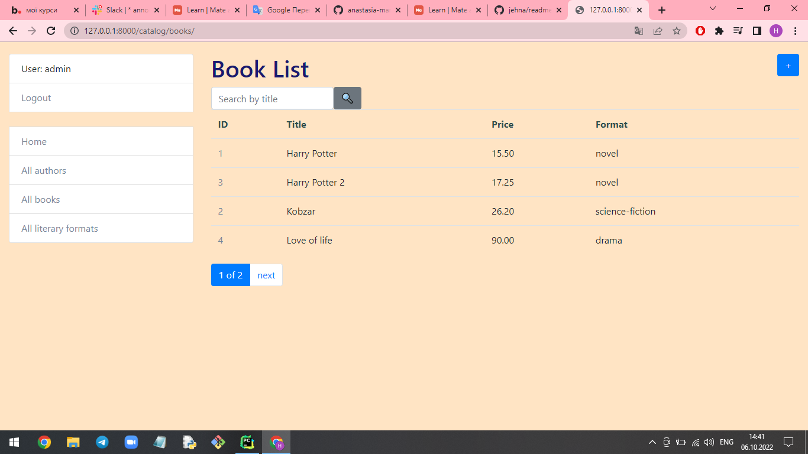

# Library Project

Django project for managing books and authors in Library.

## Installing / Getting started

Python3 must be already installed

```shell
git clone git@github.com:anastasia-martyniuk/library.git
python -m venv venv
source venv/Scripts/activate
pip install -r requirements.txt
python manage.py runserver
```

Here you should say what actually happens when you execute the code above.


## Features

What's all the bells and whistles this project can perform?
* Authentication functionality for Author/User
* Managing books authors & literary formats directly from website
* IPowerful admin panel for advanced managing

## Demo


